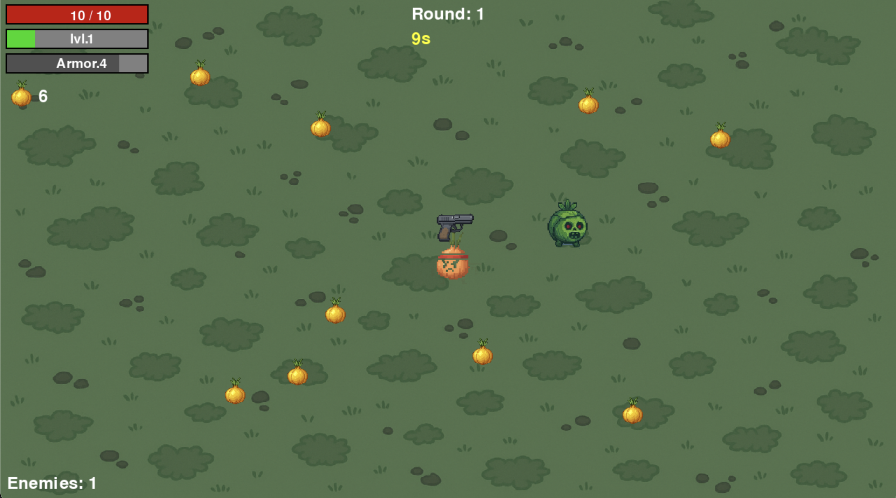
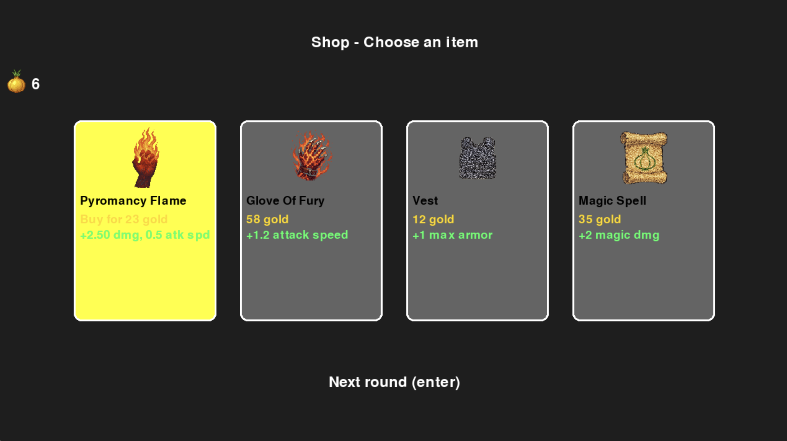
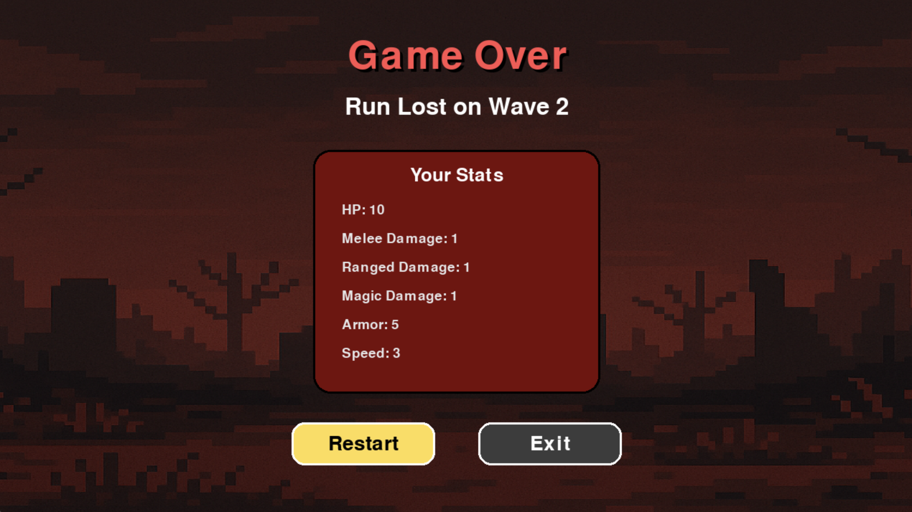

# The Last Onion

A fast-paced roguelite survival game where you fight endless waves of enemies as a lone onion warrior.

Object-Oriented Programming 2 university course final project.  
A roguelite game inspired by *Brotato*, written in Python using Pygame.

---

## Description

Survive as long as you can in an arena filled with waves of enemies. Collect gold and experience, level up, upgrade your stats, and buy new weapons and items between rounds.

The game features:

- **Top-down perspective**
- **Multiple weapon types** (sword, scythe, pistol, bow, wand, flame)
- **Level-up and upgrade system**
- **In-game shop between rounds**
- **Various enemy types**
- **Sound effects and music**

---

## Screenshots

All screenshots are located in the `docs/` folder.

### Gameplay

### Shop

### Game Over

---

## Requirements

- Python 3.8 or higher
- Pygame >= 2.0

---

## Installation

git clone https://github.com/Bartekkk12/rpg_game  
cd rpg_game  
pip install -r requirements.txt  

---

## How to Run

From the project root directory:

python main.py

---

## Project Structure

src/
├── assets/
│   └── assets.py
├── entity/
│   ├── entity.py
│   ├── enemy/
│   │   └── enemy.py
│   └── player/
│       └── player.py
├── game/
│   ├── game.py
│   ├── gold.py
│   ├── item.py
│   ├── screen.py
│   ├── settings.py
│   └── shop.py
├── sprites/
│   ├── backgrounds/
│   ├── weapons/
│   └── ...
├── weapon/
│   ├── projectile.py
│   └── weapon.py
└── main.py

---

## Controls

- W/S/A/D or Arrow keys – Move
- Space – Attack
- Enter – Confirm / select in menus
- A/D or Arrow keys – Navigate in menus and shop
- ESC – Quit

---

## Tech Stack

- Python
- Pygame
- Object-Oriented Programming (OOP)

---

## Authors

- Bartekkk12

---

## Assets

Graphics and sounds are either self-made or free to use (CC0).

---

## License

This project is for educational purposes only and is not intended for commercial use.